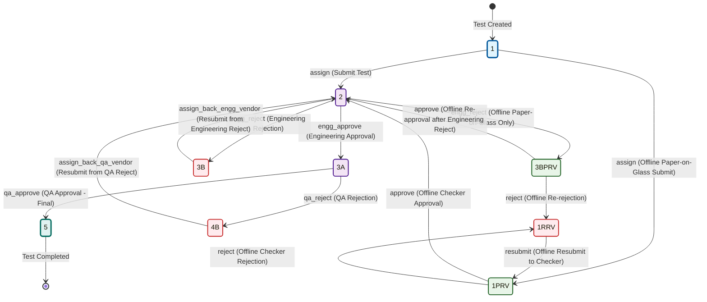
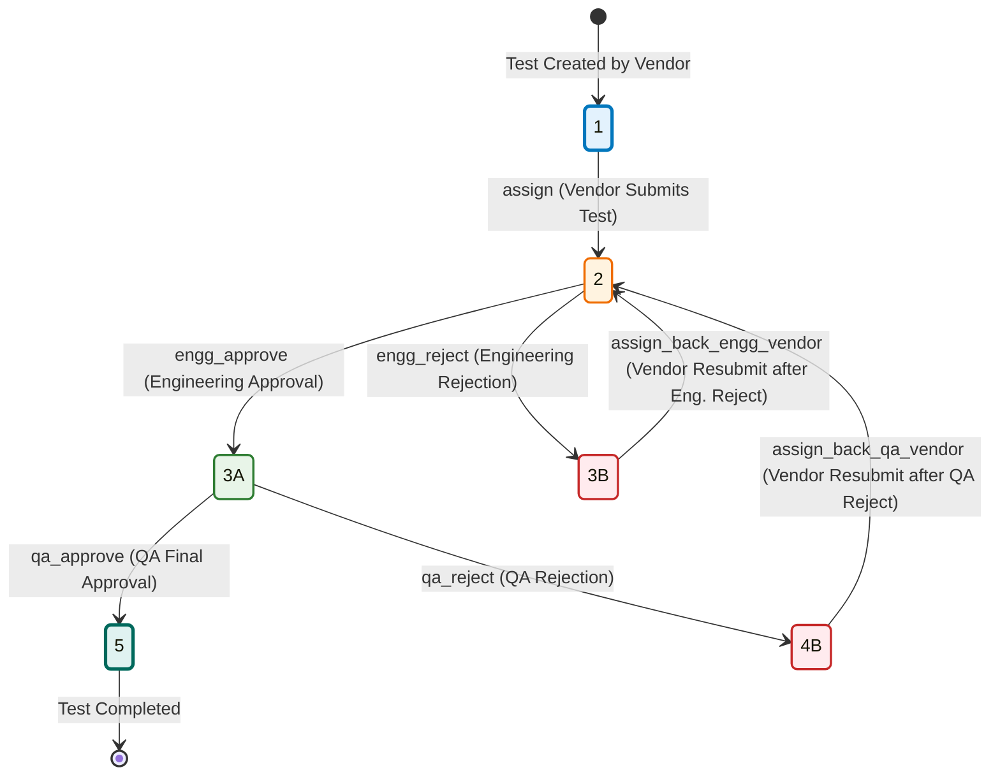

# ProVal HVAC - Test Workflow State Documentation

## Overview

The ProVal HVAC Validation Management System supports multiple workflow types for external test validation, with different state transition paths depending on the test configuration. This document provides comprehensive documentation of all supported workflows.

## Table of Contents

1. [Workflow Types](#workflow-types)
2. [Paper-on-Glass Enabled Workflow](#paper-on-glass-enabled-workflow)
3. [Standard External Test Workflow](#standard-external-test-workflow)
4. [State Definitions](#state-definitions)
5. [User Roles and Permissions](#user-roles-and-permissions)
6. [Business Rules](#business-rules)
7. [Implementation Details](#implementation-details)
8. [Troubleshooting](#troubleshooting)

---

## Workflow Types

The ProVal HVAC system supports two primary external test workflow configurations:

### 1. **Paper-on-Glass Enabled Workflow**
- **Use Case**: Tests requiring physical paper documentation alongside digital data entry
- **Data Entry Mode**: Offline (paper forms) + Online (digital verification)
- **Complexity**: High (9 states, multiple offline-specific paths)
- **Industries**: Pharmaceutical, GMP environments, regulated industries

### 2. **Standard External Test Workflow** 
- **Use Case**: Fully digital test processes
- **Data Entry Mode**: Online only
- **Complexity**: Medium (6 states, linear approval process)
- **Industries**: General HVAC validation, non-regulated environments

---

## Paper-on-Glass Enabled Workflow

### State Diagram



### State Definitions (Paper-on-Glass)

| State | Code | Name | Type | Description | User Actions |
|-------|------|------|------|-------------|--------------|
| **1** | `STAGE_NEW_TASK` | New Task | Initial | Test created, awaiting submission | Vendor: Submit Test |
| **1PRV** | `STAGE_OFFLINE_PROVISIONAL` | Offline Provisional | Offline | Awaiting offline checker review | Vendor: Approve/Reject |
| **1RRV** | `STAGE_OFFLINE_REJECTED` | Offline Rejected | Offline | Rejected by checker, awaiting resubmission | Vendor: Resubmit |
| **2** | `STAGE_PENDING_APPROVAL` | Pending Approval | Intermediate | Awaiting engineering review | Engineering: Approve/Reject |
| **3A** | `STAGE_UNIT_HEAD_APPROVAL` | Unit Head Approval | Intermediate | Engineering approved, awaiting QA | QA: Approve/Reject |
| **3B** | `STAGE_REASSIGNED_B` | Reassigned B | Rejection | Engineering rejected (standard path) | Vendor: Resubmit |
| **3BPRV** | `STAGE_OFFLINE_REJECTED_ENGG` | Offline Engineering Rejected | Offline | Engineering rejected (offline paper-on-glass) | Vendor: Approve/Reject |
| **4B** | `STAGE_REASSIGNED_4B` | Reassigned 4B | Rejection | QA rejected | Vendor: Resubmit |
| **5** | `STAGE_COMPLETED` | Completed | Final | Test fully approved and completed | None |

### Workflow Paths (Paper-on-Glass)

#### 🎯 **Primary Happy Path (Offline)**
```
1 → 1PRV → 2 → 3A → 5
```
1. Test created by vendor
2. Submitted for offline checker review  
3. Checker approves → moves to engineering
4. Engineering approves → moves to QA
5. QA approves → test completed

#### 🔄 **Offline Checker Rejection Loop**
```
1 → 1PRV → 1RRV → 1PRV → 2 → 3A → 5
```
1. Test created and submitted for offline review
2. Checker rejects → test moves to 1RRV
3. Vendor resubmits → test returns to 1PRV
4. Checker approves → continues to engineering

#### ⚠️ **Engineering Rejection (Offline Paper-on-Glass)**
```
1 → 1PRV → 2 → 3BPRV → 2 → 3A → 5
```
1. Test approved by offline checker
2. Engineering rejects → moves to special 3BPRV state
3. Vendor re-approves → returns to engineering
4. Engineering approves → continues to QA

#### 🔄 **Standard Engineering Rejection Loop**
```
1 → 2 → 3B → 2 → 3A → 5
```

#### 🔄 **QA Rejection Loop**
```
1 → 1PRV → 2 → 3A → 4B → 2 → 3A → 5
```

---

## Standard External Test Workflow

### State Diagram



### State Definitions (Standard External)

| State | Code | Name | Type | Description | User Actions |
|-------|------|------|------|-------------|--------------|
| **1** | `STAGE_NEW_TASK` | New Task | Initial | Test created, awaiting submission | Vendor: Submit Test |
| **2** | `STAGE_PENDING_APPROVAL` | Pending Approval | Intermediate | Awaiting engineering review | Engineering: Approve/Reject |
| **3A** | `STAGE_UNIT_HEAD_APPROVAL` | Unit Head Approval | Intermediate | Engineering approved, awaiting QA | QA: Approve/Reject |
| **3B** | `STAGE_REASSIGNED_B` | Reassigned B | Rejection | Engineering rejected | Vendor: Resubmit |
| **4B** | `STAGE_REASSIGNED_4B` | Reassigned 4B | Rejection | QA rejected | Vendor: Resubmit |
| **5** | `STAGE_COMPLETED` | Completed | Final | Test fully approved and completed | None |

### Workflow Paths (Standard External)

#### 🎯 **Primary Happy Path**
```
1 → 2 → 3A → 5
```

#### 🔄 **Engineering Rejection Loop**
```
1 → 2 → 3B → 2 → 3A → 5
```

#### 🔄 **QA Rejection Loop**
```
1 → 2 → 3A → 4B → 2 → 3A → 5
```

---

## State Definitions

### Complete State Reference Table

| State Code | Constant | Display Name | Type | Paper-on-Glass | Standard External | Description |
|------------|----------|--------------|------|----------------|-------------------|-------------|
| `1` | `STAGE_NEW_TASK` | New Task | Initial | ✅ | ✅ | Test created, awaiting initial submission |
| `1PRV` | `STAGE_OFFLINE_PROVISIONAL` | Offline Provisional | Offline | ✅ | ❌ | Awaiting offline checker review (paper forms) |
| `1RRV` | `STAGE_OFFLINE_REJECTED` | Offline Rejected | Offline | ✅ | ❌ | Rejected by offline checker, needs resubmission |
| `2` | `STAGE_PENDING_APPROVAL` | Pending Approval | Intermediate | ✅ | ✅ | Awaiting engineering team review |
| `3A` | `STAGE_UNIT_HEAD_APPROVAL` | Unit Head Approval | Intermediate | ✅ | ✅ | Engineering approved, awaiting QA review |
| `3B` | `STAGE_REASSIGNED_B` | Reassigned B | Rejection | ✅ | ✅ | Engineering rejected, awaiting vendor fix |
| `3BPRV` | `STAGE_OFFLINE_REJECTED_ENGG` | Offline Engineering Rejected | Offline | ✅ | ❌ | Engineering rejected offline paper-on-glass test |
| `4A` | `STAGE_REASSIGNED_4A` | Reassigned 4A | Unused | ❌ | ❌ | Reserved for future use |
| `4B` | `STAGE_REASSIGNED_4B` | Reassigned 4B | Rejection | ✅ | ✅ | QA rejected, awaiting vendor fix |
| `5` | `STAGE_COMPLETED` | Completed | Final | ✅ | ✅ | Test fully approved and completed |

---

## User Roles and Permissions

### 👨‍💼 **External Test Vendor (ETV)**

#### Permissions by State:
| State | Available Actions | Next State | Requirements |
|-------|-------------------|------------|--------------|
| `1` | Submit Test Details | `2` or `1PRV` | Complete test data entry |
| `1PRV` | Approve Test | `2` | Password + Remarks |
| `1PRV` | Reject Test | `1RRV` | Password + Remarks |
| `1RRV` | Resubmit Test | `1PRV` | Password + Remarks |
| `3BPRV` | Approve Test | `2` | Password + Remarks |
| `3BPRV` | Reject Test | `1RRV` | Password + Remarks |
| `3B` | Resubmit Test | `2` | Password + Remarks |
| `4B` | Resubmit Test | `2` | Password + Remarks |

#### Restrictions:
- ❌ Cannot review own tests
- ❌ Cannot access engineering/QA exclusive stages
- ✅ Can view test history and audit trails

### ⚙️ **Engineering Team**

#### Permissions by State:
| State | Available Actions | Next State | Requirements |
|-------|-------------------|------------|--------------|
| `2` | Approve Test | `3A` | Password + Remarks |
| `2` | Reject Test | `3B` or `3BPRV` | Password + Remarks |

#### Business Logic:
- **Standard Tests**: Reject → `3B`
- **Offline Paper-on-Glass**: Reject → `3BPRV`
- **Auto-Detection**: Based on `paper_on_glass_enabled=Yes` AND `data_entry_mode=offline`

#### Restrictions:
- ❌ Cannot review tests they performed
- ❌ Cannot access vendor-specific actions
- ✅ Can witness test executions in certain conditions

### 🔬 **Quality Assurance (QA) Team**

#### Permissions by State:
| State | Available Actions | Next State | Requirements |
|-------|-------------------|------------|--------------|
| `3A` | Final Approve | `5` | Password + Remarks + Document Review |
| `3A` | Reject Test | `4B` | Password + Remarks |

#### Special Requirements:
- ✅ Must review all uploaded documents for stage `3A`
- ✅ Document view tracking enforced
- ✅ Auto-scheduling of subsequent validations on approval

#### Restrictions:
- ❌ Cannot review tests they performed
- ❌ Limited to QA-specific stages only

---

## Business Rules

### 🔐 **Authentication & Security**

1. **Password Verification Required**: All state transitions require password confirmation
2. **CSRF Protection**: All form submissions include CSRF token validation
3. **Session Management**: 5-minute timeout for compliance requirements
4. **Account Lockout**: Failed authentication attempts trigger account lockout
5. **Audit Trail**: All actions logged with user, timestamp, and remarks

### 📋 **Data Integrity Rules**

1. **Test Finalization Required**: Test data must be finalized before submission to checker
2. **File Upload Requirements**: 
   - Offline mode: Raw Data + Test Certificate + Master Certificate required
   - Online mode: Files uploaded through web interface
3. **Same User Prevention**: Users cannot review tests they performed themselves
4. **Stage Validation**: Actions only allowed for tests in appropriate stages

### 🔄 **Workflow Rules**

1. **Paper-on-Glass Detection**: 
   ```php
   $is_offline_paper_on_glass = (
       $test_conditions['paper_on_glass_enabled'] === 'Yes' &&
       $test_conditions['data_entry_mode'] === 'offline'
   );
   ```

2. **Engineering Rejection Logic**:
   - **Standard Path**: `2 → 3B`
   - **Offline Paper-on-Glass**: `2 → 3BPRV`

3. **State Transitions**: Governed by finite state machine + custom offline logic

4. **Resubmission Limits**: No hard limits, but audit trail tracks all attempts

### 📊 **Reporting & Compliance**

1. **Status Tracking**: Real-time status updates across all workflow stages
2. **Document Management**: Version control for all uploaded documents
3. **Compliance Logging**: Detailed logs for regulatory compliance
4. **Performance Metrics**: Tracking of approval times and rejection rates

---

## Implementation Details

### 🗄️ **Database Schema**

#### Core Tables:
- **`tbl_test_schedules_tracking`**: Main workflow state tracking
- **`audit_trail`**: Complete audit history
- **`approver_remarks`**: User remarks and comments
- **`tbl_test_finalisation_details`**: Test finalization status
- **`tbl_uploads`**: File upload management

#### Key Columns:
- **`test_wf_current_stage`**: Current workflow state
- **`data_entry_mode`**: 'online' | 'offline'
- **`paper_on_glass_enabled`**: 'Yes' | 'No'
- **`test_performed_by`**: User who performed the test

### 🔧 **Backend Architecture**

#### Core Files:
- **`updatewfstage.php`**: Main workflow state transitions
- **`offline_test_review.php`**: Offline test approve/reject logic
- **`resubmit_offline_test.php`**: 1RRV → 1PRV transitions
- **`wf_ext_test.php`**: Finite state machine configuration

#### State Machine Configuration:
```php
'transitions' => [
    'assign' => ['from' => ['1'], 'to' => '2'],
    'engg_approve'  => ['from' => ['2'], 'to' => '3A'],
    'engg_reject'  => ['from' => ['2'], 'to' => '3B'],
    'assign_back_engg_vendor'  => ['from' => ['3B'], 'to' => '2'],
    'qa_approve'  => ['from' => ['3A'], 'to' => '5'],
    'qa_reject'  => ['from' => ['3A'], 'to' => '4B'],
    'assign_back_qa_vendor'  => ['from' => ['4B'], 'to' => '2'],
]
```

### 🎨 **Frontend Architecture**

#### Modal System:
- **Unified Modal**: `_esignmodal.php` handles all password/remarks collection
- **AJAX Responses**: JSON-based responses for better user experience
- **State-Aware UI**: Buttons shown/hidden based on current workflow state

#### JavaScript Integration:
```javascript
// Modal configuration for state transitions
configureRemarksModal(action, endpoint, data, successCallback);

// Example for engineering rejection
configureRemarksModal(
    'engg_reject', 
    'core/data/update/updatewfstage.php', 
    {
        test_val_wf_id: test_val_wf_id,
        action: 'engg_reject'
    },
    function(response) {
        // Redirect to assigned cases after success
        window.location.href = 'assignedcases.php';
    }
);
```

### 🔐 **Security Implementation**

#### Input Validation:
```php
class WorkflowStageValidator {
    public static function validateWorkflowUpdateData() {
        $required_fields = ['test_val_wf_id', 'val_wf_id'];
        // XSS detection and sanitization
        // CSRF token validation
        // Parameter type validation
    }
}
```

#### Authentication Flow:
```php
// Password verification with lockout protection
$authResult = verifyUserCredentials($username, $password, $userType);
if (!$authResult) {
    $_SESSION['failed_attempts'][$username]++;
    // Implement account lockout after MAX_LOGIN_ATTEMPTS
}
```

---

## Troubleshooting

### 🐛 **Common Issues**

#### 1. **"Modal not properly configured" Error**
**Cause**: Missing `configureRemarksModal()` call before showing modal
**Solution**: Ensure all button click handlers call `configureRemarksModal()` first

```javascript
$("#button_id").click(function() {
    configureRemarksModal(action, endpoint, data, callback);
    $('#enterPasswordRemark').modal('show');
});
```

#### 2. **"Test is not in reviewable stage" Error**
**Cause**: Test stage doesn't match expected stage for the action
**Solution**: Check current stage and ensure correct workflow path

```php
// For offline_test_review.php
if (!in_array($test_data['test_wf_current_stage'], ['1PRV', '3BPRV'])) {
    throw new Exception("Test is not in reviewable stage");
}
```

#### 3. **"Missing required field" Errors**
**Cause**: AJAX vs redirect parameter handling mismatch
**Solution**: Ensure backend detects AJAX requests properly

```php
$isAjaxRequest = (
    !empty($_SERVER['HTTP_X_REQUESTED_WITH']) && 
    strtolower($_SERVER['HTTP_X_REQUESTED_WITH']) === 'xmlhttprequest'
) || (isset($_POST['csrf_token']) && $_SERVER['REQUEST_METHOD'] === 'POST');
```

#### 4. **Cases Not Appearing After State Change**
**Cause**: Case moved to different workflow stage, not visible on current page
**Solution**: Redirect to `assignedcases.php` after successful state transitions

```javascript
function(response) {
    Swal.fire({
        icon: 'success',
        title: 'Success',
        text: response.message
    }).then(() => {
        window.location.href = 'assignedcases.php';
    });
}
```

### 📋 **Debugging Checklist**

#### For State Transition Issues:
- [ ] Check current `test_wf_current_stage` in database
- [ ] Verify `paper_on_glass_enabled` and `data_entry_mode` settings
- [ ] Check user permissions and department ID
- [ ] Verify CSRF token and session validity
- [ ] Review audit_trail table for transition history

#### For UI Issues:
- [ ] Check browser console for JavaScript errors
- [ ] Verify modal configuration parameters
- [ ] Check AJAX request/response in Network tab
- [ ] Validate button visibility conditions
- [ ] Test with different user roles

#### For Data Issues:
- [ ] Verify test finalization status
- [ ] Check required file uploads
- [ ] Validate test_performed_by field
- [ ] Review approver_remarks entries
- [ ] Check unit_id and vendor_id associations

---

## Conclusion

The ProVal HVAC workflow system provides robust, secure, and compliant test validation processes for both standard digital workflows and complex paper-on-glass offline workflows. The finite state machine ensures predictable state transitions while custom business logic handles industry-specific requirements.

For additional support or customization requests, please contact the development team with specific workflow requirements and use cases.

---

**Document Version**: 1.0  
**Last Updated**: September 12, 2025  
**Authors**: ProVal Development Team  
**Review Status**: Technical Review Complete